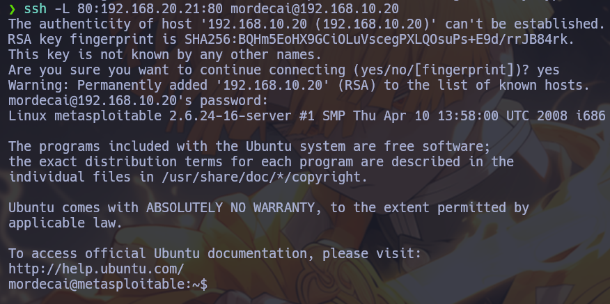
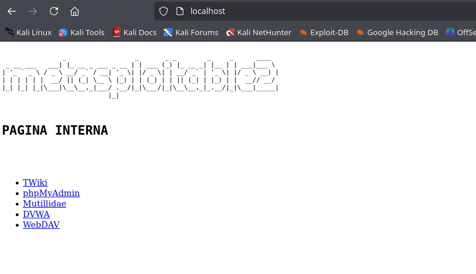
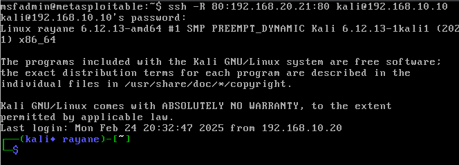

## Índice
- [Introducción](#Introducción)
- [Local Port Forwarding](#Local-Port-Forwarding)
- [Remote Port Forwarding](#Remote-Port-Forwarding)
- [Dynamic Port Forwarding](#conclusión)

## Introducción

El pivoting es una técnica esencial para acceder a sistemas internos a través de un equipo intermediario. Una de las herramientas más utilizadas para este propósito es **SSH (Secure Shell)**, que permite tunelizar tráfico de manera segura y eficiente.
En este artículo, exploraremos tres técnicas clave de **port forwarding** en SSH:
- Local Port Forwarding: Permite acceder a servicios en redes remotas a través de un puerto local.
- Remote Port Forwarding: Expone servicios locales a redes externas mediante un túnel SSH.
- Dynamic Port Forwarding: Funciona como un proxy SOCKS para enrutar tráfico hacia múltiples destinos a través de un host intermediario.


## Entorno de pruebas
s

- 3 Equipos:
    - **Máquina atacante**: Kali Linux => 192.168.10.10
    - **Máquina servidor SSH**: Ubuntu  => 192.168.10.20, 192.168.20.20
    - **Máquina servidor WEB**: Ubuntu  => 192.168.20.21

IMAGEN AQUI DE LA RED


El objetivo es acceder desde Kali hasta el Ubuntu que aloja el servidor web. Según la distribución de las redes mencionadas anteriormente, podemos notar rápidamente que no existe una conexión directa entre ambos equipos. No obstante, aprovecharemos el Ubuntu que funciona como servidor SSH y que, además, tiene acceso a ambas redes para establecer la comunicación entre Kali y el servidor web.


## Local Port Forwarding


Sintaxis:

```sh
ssh -L <Nuestro puerto local que usaremos>:<Host remoto>:<Puerto remoto> <usuario>@<ip>
```
Desglose:

- L: Habilita un túnel local.
- <\Nuestro puerto local>: Puerto en tu máquina local.
- <\Host remoto>: Dirección del host remoto al que deseas acceder.
- <\Puerto remoto>: El puerto del servicio en el host remoto.
- <\usuario>: Nombre de usuario para la conexión SSH.
- @<\ip>: IP o nombre del servidor SSH.



Comando: 

```
ssh -L 80:192.168.20.21:80 mordecai@192.168.10.20
```

Por lo que en este punto, si nos vamos al navegador **manteniendo la sesión SSH abierta** y vamos a la dirección: http://localhost/, veremos el servidor web:




## Remote Port Forwarding

El Remote Port Forwarding (Reenvío de Puerto Remoto) es un concepto similar al Local Port Forwarding, pero con la diferencia clave de que en lugar de redirigir un puerto desde tu máquina local hacia un host remoto, el reenvío de puerto remoto redirige un puerto desde un servidor remoto hacia un host local o un servicio dentro de una red privada.

En términos sencillos, Remote Port Forwarding permite que un puerto en una máquina remota se conecte a un servicio en tu máquina local o en una red privada a través de una conexión SSH. Esto puede ser útil si deseas hacer accesible un servicio local desde un servidor remoto.


Diferencia con Local Port Forwarding:
- Local Port Forwarding: Redirige un puerto desde tu máquina local hacia un servicio remoto.
- Remote Port Forwarding: Redirige un puerto desde un servidor remoto hacia tu máquina local o un servicio dentro de tu red.

Sintaxis:

```sh
ssh -R <puerto_remoto>:<host_local>:<puerto_local> <usuario>@<ip_remota>
```

Entonces, volviendo a la práctica, ejecutariamos lo siguiente en el Ubuntu (servidor SSH):




| Attribute     | Description                                                                                                                                                                                                 |
|---------------|-------------------------------------------------------------------------------------------------------------------------------------------------------------------------------------------------------------|
| `title`       | The title of the post.                                                                                                                                                                                      |
| `published`   | The date the post was published.                                                                                                                                                                            |
| `description` | A short description of the post. Displayed on index page.                                                                                                                                                   |
| `image`       | The cover image path of the post.<br/>1. Start with `http://` or `https://`: Use web image<br/>2. Start with `/`: For image in `public` dir<br/>3. With none of the prefixes: Relative to the markdown file |
| `tags`        | The tags of the post.                                                                                                                                                                                       |
| `category`    | The category of the post.                                                                                                                                                                                   |
| `draft`        | If this post is still a draft, which won't be displayed.                                                                                                                                                    |

## Where to Place the Post Files


Your post files should be placed in `src/content/posts/` directory. You can also create sub-directories to better organize your posts and assets.

```
src/content/posts/
├── post-1.md
└── post-2/
    ├── cover.png
    └── index.md
```
