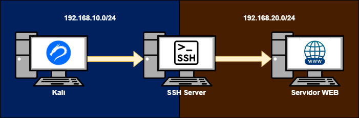
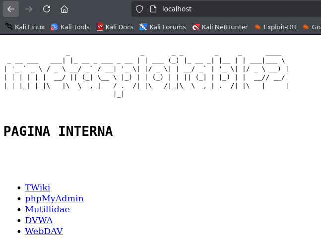
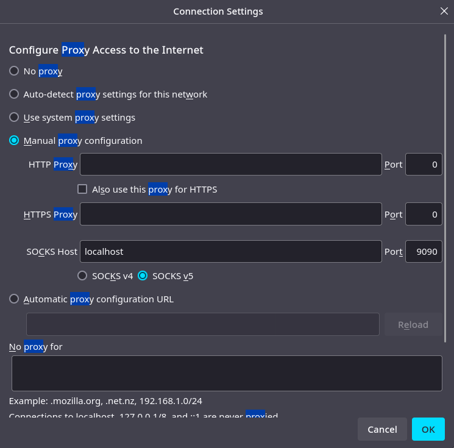
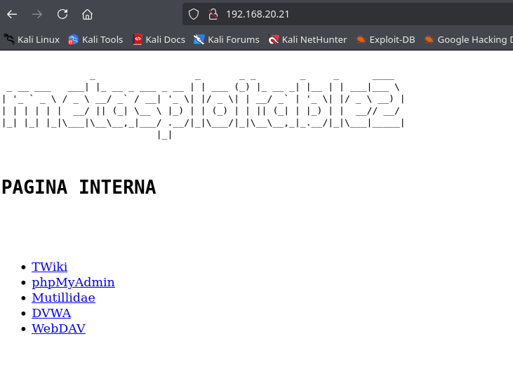

## Índice
- [Introducción](#Introducción)
- [Local Port Forwarding](#Local-Port-Forwarding)
- [Remote Port Forwarding](#Remote-Port-Forwarding)
- [Dynamic Port Forwarding](#Dynamic-Port-Forwarding)
- [Conclusión](#Conclusión)

## Introducción

El pivoting es una técnica esencial para acceder a sistemas internos a través de un equipo intermediario. Una de las herramientas más utilizadas para este propósito es **SSH (Secure Shell)**, que permite tunelizar tráfico de manera segura y eficiente.
En este artículo, exploraremos tres técnicas clave de **port forwarding** en SSH:
- Local Port Forwarding: Permite acceder a servicios en redes remotas a través de un puerto local.
- Remote Port Forwarding: Expone servicios locales a redes externas mediante un túnel SSH.
- Dynamic Port Forwarding: Funciona como un proxy SOCKS para enrutar tráfico hacia múltiples destinos a través de un host intermediario.


## Entorno de pruebas

- 3 Equipos:
    - **Máquina atacante**: Kali Linux => 192.168.10.10
    - **Máquina servidor SSH**: Ubuntu  => 192.168.10.20, 192.168.20.20
    - **Máquina servidor WEB**: Ubuntu  => 192.168.20.21




El objetivo es acceder desde Kali hasta el Ubuntu que aloja el servidor web. Según la distribución de las redes mencionadas anteriormente, podemos notar rápidamente que no existe una conexión directa entre ambos equipos. No obstante, aprovecharemos el Ubuntu que funciona como servidor SSH y que, además, tiene acceso a ambas redes para establecer la comunicación entre Kali y el servidor web.


## Local Port Forwarding


Sintaxis:

```sh
ssh -L <Nuestro puerto local que usaremos>:<Host remoto>:<Puerto remoto> <usuario>@<ip>
```
Desglose:

- `-L`: Habilita un túnel local.
- `<Nuestro puerto local>`: Puerto en tu máquina local.
- `<Host remoto>`: Dirección del host remoto al que deseas acceder.
- `<Puerto remoto>`: El puerto del servicio en el host remoto.
- `<usuario>`: Nombre de usuario para la conexión SSH.
- `@<ip>`: IP o nombre del servidor SSH.


Comando: 

```
ssh -L 80:192.168.20.21:80 mordecai@192.168.10.20
```

Por lo que en este punto, si nos vamos al navegador **manteniendo la sesión SSH abierta** y vamos a la dirección: http://localhost/, veremos el servidor web:


## Remote Port Forwarding

El Remote Port Forwarding (Reenvío de Puerto Remoto) es un concepto similar al Local Port Forwarding, pero con la diferencia clave de que en lugar de redirigir un puerto desde tu máquina local hacia un host remoto, el reenvío de puerto remoto redirige un puerto desde un servidor remoto hacia un host local o un servicio dentro de una red privada.

En términos sencillos, Remote Port Forwarding permite que un puerto en una máquina remota se conecte a un servicio en tu máquina local o en una red privada a través de una conexión SSH. Esto puede ser útil si deseas hacer accesible un servicio local desde un servidor remoto.


Diferencia con Local Port Forwarding:
- Local Port Forwarding: Redirige un puerto desde tu máquina local hacia un servicio remoto.
- Remote Port Forwarding: Redirige un puerto desde un servidor remoto hacia tu máquina local o un servicio dentro de tu red.

Sintaxis:

```sh
ssh -R <puerto_remoto>:<host_local>:<puerto_local> <usuario>@<ip_remota>
```

Entonces, volviendo a la práctica, ejecutariamos lo siguiente en el Ubuntu (servidor SSH):


Comando: 

```
ssh -R 80:192.168.20.21:80 mordecai@192.168.10.10
```
Así, al iniciar sesión en Kali, le estamos indicando que habilite el puerto 80 y lo dirija hacia el sistema Debian que funciona como servidor web. Esto es posible porque el Debian desde el que establecemos la conexión tiene acceso a ambas redes, lo que permite su interconexión.

Con esto configurado, si desde Kali accedemos a ``localhost``, estaremos dirigiendo la conexión al servicio alojado en el servidor Debian a través del puerto 80.



>>>Importante: Si la conexión SSH se interrumpe, el Remote Port Forwarding dejará de funcionar, lo que impedirá el acceso al servicio redirigido.


## Dynamic Port Forwarding


Dynamic Port Forwarding permite, a diferencia de los otros tipos de reenvío de puertos (Local y Remote), crear un túnel que redirige el tráfico de múltiples puertos a través de un solo puerto usando el protocolo SOCKS. Esto te permite usar aplicaciones, como un navegador, para enrutar todo el tráfico de red de manera segura a través de una conexión SSH, sin tener que configurar puertos específicos para cada aplicación.

Sintaxis:

```sh
ssh -D <puerto local que actuará de proxy> <usuario>@<IP>
```

Configuracion del navegador para usar SOCKS5 como proxy:




Una vez configurado:



>>>Importante: Usa el mismo puerto del socks5.


## Conclusión

El uso de SSH para realizar pivoting y redirigir puertos dentro de redes privadas es una técnica poderosa y versátil que nos permite acceder a sistemas que de otro modo serían inaccesibles debido a la falta de una conexión directa. A través de las tres técnicas de Port Forwarding — Local, Remote y Dynamic — podemos manipular el tráfico de manera eficiente y segura.

- Local Port Forwarding nos da la capacidad de acceder a servicios remotos desde nuestra máquina local a través de un túnel seguro.
- Remote Port Forwarding permite exponer servicios locales a través de un servidor remoto, facilitando el acceso a redes internas de manera controlada.
- Dynamic Port Forwarding nos ofrece la posibilidad de crear un túnel dinámico para redirigir múltiples puertos usando SOCKS, proporcionando una forma flexible y segura de navegar por la red.

Sin embargo, es importante tener en cuenta que las conexiones SSH deben mantenerse activas para que el Remote Port Forwarding y el Dynamic Port Forwarding continúen funcionando, ya que si se interrumpe la sesión, los túneles también se cerrarán.

Estas técnicas son fundamentales en escenarios de pentesting y auditorías de seguridad, donde el acceso remoto a servicios internos se convierte en una necesidad. Implementar correctamente estas configuraciones puede mejorar significativamente nuestra capacidad para pivotar y explorar redes protegidas.


